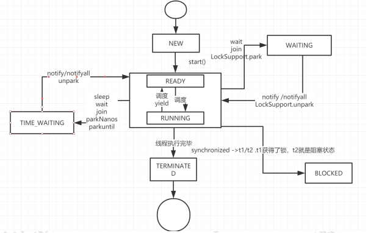
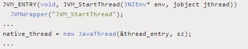
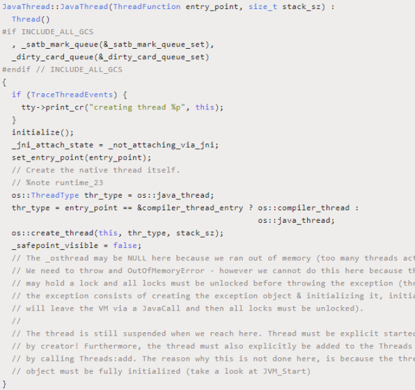
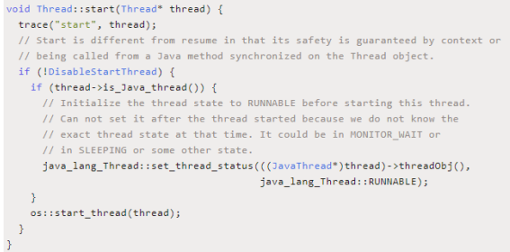
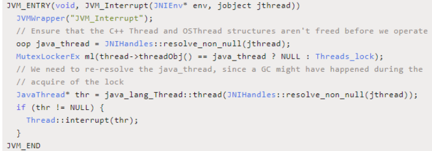
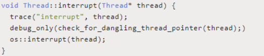
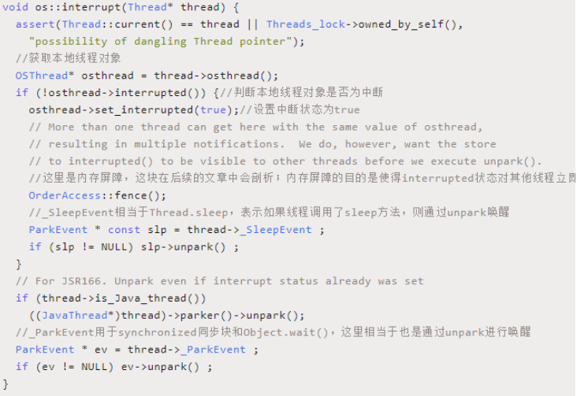
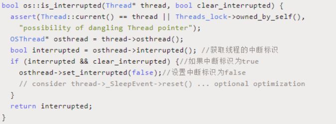
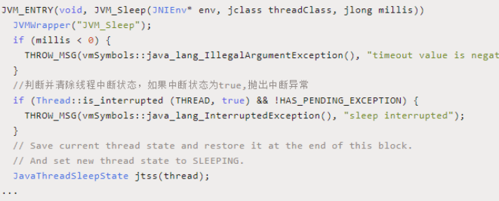

### 一、线程的生命周期

Java 线程 既然能够创建，那么也势必会被销毁所以线程 既然能够创建，所以线程是存在生命周期的。

线程一共有 6 种状态（NEW、RUNNABLE、BLOCKED、 WAITING、TIME_WAITING、TERMINATED） 

NEW：初始状态，线程被构建，但是还没有调用 start 方法 

RUNNABLED：运行状态，JAVA 线程把操作系统中的就绪 和运行两种状态统一称为“运行中” 

BLOCKED：阻塞状态，表示线程进入等待状态,也就是线程 因为某种原因放弃了 CPU 使用权，阻塞也分为几种情况

- 等待阻塞：运行的线程执行 wait 方法，jvm 会把当前 线程放入到等待队列

- 同步阻塞：运行的线程在获取对象的同步锁时，若该同 步锁被其他线程锁占用了，那么 jvm 会把当前的线程 放入到锁池中
- 其他阻塞：运行的线程执行 Thread.sleep 或者 t.join 方 法，或者发出了 I/O 请求时，JVM 会把当前线程设置 为阻塞状态，当 sleep 结束、join 线程终止、io 处理完 毕则线程恢复

TIME_WAITING：超时等待状态，超时以后自动返回 

TERMINATED：终止状态，表示当前线程执行完毕



wait, notify, join, yield：

其中wait, notify都是Object的方法，join是Thread的实例方法，yield是Thread的静态方法。

Object.wait：会使得当前线程进入waiting，直到另一个线程调用notify或者notifyAll方法来唤醒它，或者是指定了等待时间。因此也有重载方法wait(long)，让线程等待一定的时间之后，线程就自行恢复runnable状态了。当然该方法需在synchronized里面使用

Object.notify：唤醒一个waiting态的线程，这个线程呢，必须是用同一把锁进入waiting态的。该方法需在synchronized里面使用

Thread.join：调用threadA.join()的线程，要进入waiting状态，一直到线程threadA执行完毕。

```java
public static void main() { 
    Thread t1 = new Thread(…); 
    t1.join(); 
    // 这行代码必须要等t1全部执行完毕，才会执行 
} 
```

Thread.yield：前线程愿意放弃cpu的使用，愿意将cpu让给其它的线程。


### 二、显示线程状态

启动一个线程前，最好为这个线程设置线程名称，因为这 样在使用 jstack 分析程序或者进行问题排查时，就会给开 发人员提供一些提示 显示线程的状态

- 运行该示例，打开终端或者命令提示符，键入“jps”， （JDK1.5 提供的一个显示当前所有 java 进程 pid 的命 令）
- 根据上一步骤获得的 pid，继续输入 jstack pid（jstack 是 java 虚拟机自带的一种堆栈跟踪工具。jstack 用于 打印出给定的 java 进程 ID 或 core file 或远程调试服 务的 Java 堆栈信息）

通过上面的分析，我们了解到了线程的生命周期，现在在 整个生命周期中并不是固定的处于某个状态，而是随着代 码的执行在不同的状态之间进行切换


### 三、线程的启动

调用 start()方法去启动一个线程，当 run 方法中的代码执行完毕 以后，线程的生命周期也将终止。

##### 1.线程的启动原理：

启动一个线程 为什么是调用 start 方法，而不是 run 方法，这做一个简单 的分析，先简单看一下 start 方法的定义

```java
class Thread implements Runnable {
...
public synchronized void start() {
    /**
     * This method is not invoked for the main method thread or "system"
     * group threads created/set up by the VM. Any new functionality added
     * to this method in the future may have to also be added to the VM.
     *
     * A zero status value corresponds to state "NEW".
     */
    if (threadStatus != 0)
        throw new IllegalThreadStateException();

    /* Notify the group that this thread is about to be started
     * so that it can be added to the group's list of threads
     * and the group's unstarted count can be decremented. */
    group.add(this);

    boolean started = false;
    try {
        start0();
        started = true;
    } finally {
        try {
            if (!started) {
                group.threadStartFailed(this);
            }
        } catch (Throwable ignore) {
            /* do nothing. If start0 threw a Throwable then
              it will be passed up the call stack */
        }
    }
}

private native void start0();//注意看这里
```

start 方法实际上是调用一个 native 方法 start0()来启动一个线程，首先 start0()这个方法是在 Thread 的静态块中来注册的，代码如下：

```java
class Thread implements Runnable {
    /* Make sure registerNatives is the first thing <clinit> does. */
    private static native void registerNatives();
    static {
        registerNatives();
    }
```

registerNatives 的 本 地 方 法 的 定 义 在 文 件 Thread.c,Thread.c 定义了各个操作系统平台要用的关于线 程的公共数据和操作，以下是 Thread.c 的全部内容

http://hg.openjdk.java.net/jdk8/jdk8/jdk/file/00cd9dc3c2b5/src/share/native/java/lang/Thread.c

```c
static JNINativeMethod methods[] = {
    {"start0",           "()V",        (void *)&JVM_StartThread},
    {"stop0",            "(" OBJ ")V", (void *)&JVM_StopThread},
    {"isAlive",          "()Z",        (void *)&JVM_IsThreadAlive},
    {"suspend0",         "()V",        (void *)&JVM_SuspendThread},
    {"resume0",          "()V",        (void *)&JVM_ResumeThread},
    {"setPriority0",     "(I)V",       (void *)&JVM_SetThreadPriority},
    {"yield",            "()V",        (void *)&JVM_Yield},
    {"sleep",            "(J)V",       (void *)&JVM_Sleep},
    {"currentThread",    "()" THD,     (void *)&JVM_CurrentThread},
    {"countStackFrames", "()I",        (void *)&JVM_CountStackFrames},
    {"interrupt0",       "()V",        (void *)&JVM_Interrupt},
    {"isInterrupted",    "(Z)Z",       (void *)&JVM_IsInterrupted},
    {"holdsLock",        "(" OBJ ")Z", (void *)&JVM_HoldsLock},
    {"getThreads",        "()[" THD,   (void *)&JVM_GetAllThreads},
    {"dumpThreads",      "([" THD ")[[" STE, (void *)&JVM_DumpThreads},
};

#undef THD
#undef OBJ
#undef STE

JNIEXPORT void JNICALL
Java_java_lang_Thread_registerNatives(JNIEnv *env, jclass cls)
{
    (*env)->RegisterNatives(env, cls, methods, ARRAY_LENGTH(methods));
}
```

从 这 段 代 码 可 以 看 出 ， start0() ，实际会执行JVM_StartThread 方法，这个方法是干嘛的呢？ 从名字上来看，似乎是在 JVM 层面去启动一个线程，如果真的是这样，那么在 JVM 层面，一定会调用 Java 中定义的 run 方法。那接下来继续去找找答案。我们找到 jvm.cpp 这个文 件；这个文件需要下载 hotspot 的源码才能找到:



JVM_ENTRY 是用来定义 JVM_StartThread 函数的，在这 个函数里面创建了一个真正和平台有关的本地线程. 本着 打破砂锅查到底的原则，继续看看 new JavaThread 做了什 么事情,继续寻找 JavaThread 的定义 在 hotspot 的源码中 thread.cpp 文件中 1558 行的位置可 以找到如下代码



这个方法有两个参数，第一个是函数名称，线程创建成功 之后会根据这个函数名称调用对应的函数；第二个是当前 进程内已经有的线程数量。重点关注os::create_thread,实际就是调用平台创建线程的方法来创建线程。 接下来就是线程的启动，会调用 Thread.cpp 文件中的 Thread::start(Thread* thread)方法，代码如下



start 方法中有一个函数调用： os::start_thread(thread);， 调用平台启动线程的方法，最终会调用 Thread.cpp 文件中 的 JavaThread::run()方法


### 四、线程终止

线程的终止，并不是简单的调用 stop 命令去。虽然 api 仍 然可以调用，但是和其他的线程控制方法如 suspend、 resume 一样都是过期了的不建议使用，就拿 stop 来说， stop 方法在结束一个线程时并不会保证线程的资源正常释放，因此会导致程序可能出现一些不确定的状态。 要优雅的去中断一个线程，在线程中提供了一个 interrupt 方法

##### 1、interrupt 方法：

当其他线程通过调用当前线程的 interrupt 方法，告诉线程可以中断执行了，至于什 么时候中断，取决于当前线程自己。 线程通过检查自身是否被中断来进行相应的结果处理，可以通过 isInterrupted()来判断是否被中断。 通过下面这个例子，来实现了线程终止的逻辑

```java
public class InterruptDemo {
    private static int i;
    public static void main(String[] args) throws InterruptedException {
        Thread thread=new Thread(()->{
            while(!Thread.currentThread().isInterrupted()){ 
                //默认情况下isInterrupted 返回 false、通过 thread.interrupt 变成了 true
                i++;
            }
            System.out.println("Num:"+i);
        },"interruptDemo");
        thread.start();
        TimeUnit.SECONDS.sleep(1);
        thread.interrupt(); //加和不加的效果
    }
}
```

这种通过标识位或者中断操作的方式能够使线程在终止时 有机会去清理资源，而不是武断地将线程停止，因此这种 终止线程的做法显得更加安全和优雅

##### 2.Thread.interrupted：

上面的案例中，通过 interrupt，设置了一个标识告诉线程可以终止了 ， 线程中还提供了静态方法Thread.interrupted()对设置中断标识的线程复位。比如在上面的案例中，外面的线程调用 thread.interrupt 来设置中 断标识，而在线程里面，又通过Thread.interrupted 把线 程的标识又进行了复位

```java
public class InterruptDemo {
    private static int i;
    public static void main(String[] args) throws InterruptedException {
        Thread thread = new Thread(() -> {
            while (true) {
                if (Thread.currentThread().isInterrupted()) {
                    System.out.println("before:" + Thread.currentThread().isInterrupted());
                    Thread.interrupted(); //对线程进行复位，由 true 变成 false
                    System.out.println("after:" + Thread
                            .currentThread().isInterrupted());
                }
            }
        }, "interruptDemo");
        thread.start();
        TimeUnit.SECONDS.sleep(1);
        thread.interrupt();
    }
}
```

##### 3.其他的线程复位：

除了通过 Thread.interrupted 方法对线程中断标识进行复位以外， 还有一种被动复位的场景，就是对抛 出 InterruptedException异常的方法，在 InterruptedException 抛出之前，JVM 会先把线程的中断标识位清除，然后才会抛出 InterruptedException，这个时 候如果调用 isInterrupted 方法，将会返回 false 分别通过下面两个 demo 来演示复位的效果

```java
public class InterruptDemo {
    private static int i;
    public static void main(String[] args) throws InterruptedException{
        Thread thread=new Thead(()->{
            while(!Thread.currentThread().isInterrupted()){
                i++;
            }
            System.out.println("Num:"+i);
        },"interruptDemo");
        thread.start();
        TimeUnit.SECONDS.sleep(1);
        thread.interrupt();
        System.out.println(thread.isInterrupted());
    }
}
```

```java
public class InterruptDemo {
    private static int i;
    public static void main(String[] args) throws InterruptedException {
        Thread thread=new Thread(()->{
            while(!Thread.currentThread().isInterrupted()){
                try {
                    TimeUnit.SECONDS.sleep(1);
                } catch(InterruptedException e) {
                    e.printStackTrace();
                }
            }
            System.out.println("Num:"+i);
        },"interruptDemo");
        thread.start();
        TimeUnit.SECONDS.sleep(1);
        thread.interrupt();
        System.out.println(thread.isInterrupted());
    }
}
```

为什么要复位 Thread.interrupted()是属于当前线程的，是当前线程对外 界中断信号的一个响应，表示自己已经得到了中断信号， 但不会立刻中断自己，具体什么时候中断由自己决定，让 外界知道在自身中断前，他的中断状态仍然是 false，这就 是复位的原因。


### 五、线程的终止原理

我们来看一下 thread.interrupt()方法做了什么事情

```java
public void interrupt() {
    if (this != Thread.currentThread())
        checkAccess();

    synchronized (blockerLock) {
        Interruptible b = blocker;
        if (b != null) {
            interrupt0();           // Just to set the interrupt flag
            b.interrupt(this);
            return;
        }
    }
    interrupt0();
}
```

这个方法里面，调用了 interrupt0()，这个方法在前面分析 start 方法的时候见过，是一个 native 方法，这里就不再重 复贴代码了，同样，我们找到 jvm.cpp 文件，找到 JVM_Interrupt 的定义



这个方法比较简单，直接调用了 Thread::interrupt(thr)这 个方法，这个方法的定义在 Thread.cpp 文件中，代码如下



Thread::interrupt 方法调用了 os::interrupt 方法，这个是调用平台的 interrupt 方法，这个方法的实现是在 os_*.cpp 文件中，其中星号代表的是不同平台，因为 jvm 是跨平台 的，所以对于不同的操作平台，线程的调度方式都是不一 样的。我们以 os_linux.cpp 文件为例



set_interrupted(true)实际上就是调用 osThread.hpp 中的 set_interrupted()方法，在 osThread 中定义了一个成员属 性 volatile jint _interrupted

通过上面的代码分析可以知道，thread.interrupt()方法实际 就是设置一个 interrupted 状态标识为 true、并且通过 ParkEvent 的 unpark 方法来唤醒线程。 

- 对于 synchronized 阻塞的线程，被唤醒以后会继续尝试 获取锁，如果失败仍然可能被 park
-  在调用 ParkEvent 的 park 方法之前，会先判断线程的中断状态，如果为 true，会清除当前线程的中断标识 
-  Object.wait 、 Thread.sleep 、 Thread.join 会 抛 出 InterruptedException

为什么 Object.wait、 Thread.sleep 和 Thread.join 都 会 抛 出 InterruptedException? 你会发现这几个方法有一个共同 点，都是属于阻塞的方法 而阻塞方法的释放会取决于一些外部的事件，但是阻塞方法可能因为等不到外部的触发事件而导致无法终止，所以它允许一个线程请求自己来停止它正在做的事情。当一个 方法抛出 InterruptedException 时，它是在告诉调用者如果执行该方法的线程被中断，它会尝试停止正在做的事情 并且通过抛出 InterruptedException 表示提前返回。 所以，这个异常的意思是表示一个阻塞被其他线程中断了。 然 后 ， 由于线程调用了interrupt()中断方法，那么Object.wait、Thread.sleep 等被阻塞的线程被唤醒以后会通过is_interrupted方法判断中断标识的状态变化，如果发现中断标识为 true，则先清除中断标识，然后抛出 InterruptedException。

需要注意的是，InterruptedException 异常的抛出并不意味着线程必须终止，而是提醒当前线程有中断的操作发生， 至于接下来怎么处理取决于线程本身，比如

- 直接捕获异常不做任何处理 
- 将异常往外抛出 
- 停止当前线程，并打印异常信息

为了让大家能够更好的理解上面这段话，我们以Thread.sleep为例直接从 jdk 的源码中找到中断标识的清 除以及异常抛出的方法代码找到 is_interrupted() 方法， linux 平 台 中 的 实 现 在 os_linux.cpp 文件中，代码如下



找到 Thread.sleep 这个操作在 jdk 中的源码体现，怎么找? 相信如果前面大家有认真看的话，应该能很快找到，代码 在 jvm.cpp 文件中



注意上面加了中文注释的地方的代码，先判断 is_interrupted 的 状 态 ， 然 后 抛 出 一 个 InterruptedException 异常。到此为止，我们就已经分析清 楚了中断的整个流程。

